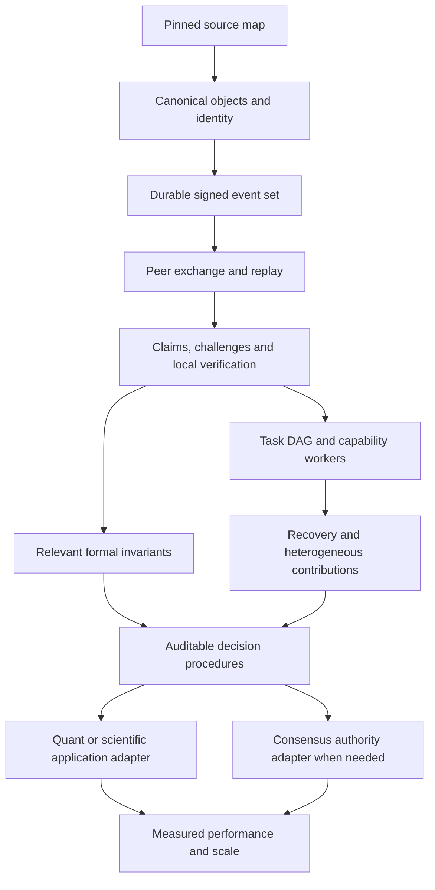

# Intelligence Lattice — Phase 0 and first executable slice

Snapshot: 29–30 September 2026. Owner: `aixaria0`. This is a repository-grounded integration plan, not a replacement architecture. The companion `intelligence-lattice-source-inventory.json` records the discovered account repositories, inspected branches, commit identities, open PRs, source paths and workflow URLs. GitHub state will continue to change; these conclusions apply to the recorded snapshot.

## Findings that determine the plan

There is useful engineering here, but no inspected repository yet implements the complete distributed knowledge/claim lifecycle in the request. The closest composition is the **four-repository assurance fabric**: bounded verification/repair in the compiler, structural observation in Sentinel, read-only inspection in rlsenti, and an independent evidence-root binding in Sovereign. That chain is distributed across open PRs, not one released protocol or continuously running lattice.

The shortest justified next step is a **signed, persistent event/evidence protocol beside the compiler's existing protocol-neutral verification core**. Start with contradictory claims, evidence requests, deterministic verification and replay across two independent processes. Keep scheduling, external actions, global governance, provider integrations and consensus outside this first slice. This avoids both rewriting working research and mistaking several chat endpoints for collective intelligence.

Three distinctions are essential:

* Signed bytes establish attributable integrity, not correctness or source independence.
* A verification result is bounded by its adapter, model, scope and assumptions. Local reproduction is a stronger acceptance condition than trusting a `verified` flag.
* A decision is an actor's result under a named procedure and authority scope. It is not universal truth, and merging knowledge does not authorize execution.

## A. System inventory: actual responsibilities today

Exact full SHAs and workflow identities are in the inventory. Short pins below are for reading, not dependency resolution. Status describes the selected branch, not every branch or a production deployment.

| Repository / inspected revision | Actual implementation | Reuse and boundary |
|---|---|---|
| [Sovereign-Lattice](https://github.com/aixaria0/Sovereign-Lattice), PR 3, `20b7a3b` | Rust/Tokio PBFT messages/certificates, BLS, DKG, framed TCP, WAL, cluster smoke; Lean library; repair-root module. Exact-head Rust, smoke and Lean workflows succeeded. | **KEEP INDEPENDENT + ADAPT.** Candidate for agreed policy epochs, membership/configuration and exclusive execution authority. The repair-root function hashes supplied evidence; it does not itself obtain a PBFT quorum or verify native replay. |
| [RCHAIN-COMPLIER](https://github.com/aixaria0/RCHAIN-COMPLIER), PR 21, `be2ac327` | TypeScript bounded verification compiler, finite-state/lexicographic search, repair compiler/packages, signed attestations and CBC/native replay harnesses. Seven exact-head workflows succeeded. | **ADAPT; EXTRACT LIBRARY LATER.** Evidence production, deterministic verification and protocol objects. Preserve Casper research branches and PR 16. `main` contains reference documentation; it is not interchangeable with PR 21. |
| [rlsenti](https://github.com/aixaria0/rlsenti), PR 3, `2ee77eaf` | React/TypeScript workbench and portable-repair inspection. Exact-head CI succeeded. | **KEEP INDEPENDENT + ADAPT.** Human review/read models and schema inspection. No inspected general-purpose network ingestion daemon. Never treat a rendered badge as independent verification. |
| [rchain-sentinel](https://github.com/aixaria0/rchain-sentinel), PR 7, `d0ef45e1` | Rust/Axum RNode observations, endpoint/block consistency, cross-node inspection, repair-envelope observation, deterministic synthetic Reality endpoints. Exact-head CI succeeded. | **KEEP INDEPENDENT + ADAPT.** Telemetry/observation adapter. Structural acceptance of a repair envelope does not verify the referenced native computation. Preserve live/synthetic separation. |
| [nexus-quantum](https://github.com/aixaria0/nexus-quantum), `main`, `d1cbd362` | VQE/backend/UI research and QLF NullCone module; workflow builds upstream QLF then checks the local module. | **RESEARCH ONLY, then ADAPT formal receipts.** Current exact-head formal workflow failed on actual Lean goals; successful Pages deploys do not repair that. Upstream `main` is unpinned. No general lattice invariant proof yet. |
| [vqe-analyzer](https://github.com/aixaria0/vqe-analyzer), `3853fd9b` | Browser visualizer and Python VQE solvers. Selected-head lint failed; Pages succeeded. | **APPLICATION / RESEARCH ONLY.** Later a typed scientific job and artifact producer, if a concrete task needs it. No forced architectural dependency. |
| [aether-runtime](https://github.com/aixaria0/aether-runtime), PR 3, `37b6f3e3` | Rust/Axum admission/control API, C++ gRPC echo/uppercase/SHA256 service, bounded permits/receipts; separate Python workflows. | **KEEP INDEPENDENT + ADAPT.** Candidate execution adapter, not a proven distributed execution kernel. Component CI passed; end-to-end failed. Logs show the test expects HTTP 400 for an unsupported operation while the API returns 422. Fix and rerun before claiming readiness. |
| [AriaTrading](https://github.com/aixaria0/AriaTrading), PR 24, `664b8412` | Private TypeScript market-feed routing, prediction coordination, governance/calibration state, terminal API and seven-venue display work. Quant Core CI succeeded. | **APPLICATION ONLY.** Future observation/forecast/calibration adapter; private data stays local by default. Approval status and display visibility remain separate. No order-execution authority flows from lattice consensus. |
| [strategic-intelligence-lattice](https://github.com/aixaria0/strategic-intelligence-lattice), `80708866` | Python synthetic tournament/query lab, Bayesian computation allocation, certificate planning, fair bulk baselines, holdout benchmarks and archives. CI succeeded. | **KEEP INDEPENDENT / RESEARCH ONLY for algorithms.** A useful existing home for private program planning. Do not turn synthetic probability estimates into real-world certification. Its README says PUBLIC although GitHub metadata says private. |
| [Chimera-AG](https://github.com/aixaria0/Chimera-AG), `93cfbceb` | Python bounded model endpoints, council/fabric, domain-conditioned routing observations, experiment ledger and independently tested coding workflows. CI and local-model workflow succeeded. | **KEEP INDEPENDENT + ADAPT.** Reuse endpoint/budget/routing/tool adapters. Older Fabric majority and Council reviewer agreement are procedural outputs, not claim truth. Native Anthropic/Google API semantics are not established by OpenAI-compatible support. |
| [Fun](https://github.com/aixaria0/Fun) | Node/Express provider registry for mock/OpenRouter/Ollama, SSE fan-out and judge synthesis. | **APPLICATION ONLY / ADAPTER CANDIDATE.** Overlaps Chimera endpoint orchestration; no reason to make both independent lattice coordinators. |
| [Aix](https://github.com/aixaria0/Aix) | VQE/pharmacy modules, documentation, mobile/backend work. | **RESEARCH/APPLICATION ONLY.** Chemistry jobs may later emit datasets and experimental receipts. Hardware/scientific claims need separate measured validation. |
| [Vqe](https://github.com/aixaria0/Vqe) | Small in-process agent framework with print-based task dispatch. | **KEEP AS ARCHIVE / RESEARCH.** No evidence this is a distributed runtime. |
| [Omni](https://github.com/aixaria0/Omni), [Oss](https://github.com/aixaria0/Oss), [OSint](https://github.com/aixaria0/OSint) | Domain collection/fusion or OSINT UI/backend tools. Omni has explicit hypotheses/support/contradiction fields and heuristic posteriors. OSint's latest inspected CI failed. | **APPLICATION ONLY.** Potential external-observation schemas; heuristic scores are not calibrated probabilities. Any external collection remains explicitly authorized and bounded. |
| [QLF](https://github.com/aixaria0/QLF) | TypeScript Raft/Paxos/Byzantine teaching/model workbench, obligation text and bounded enumerators. | **RESEARCH ONLY.** The title is not proof that this is the Lean QLF repository. Preserve bounded model-checking examples as potential test fixtures. No Actions found. |
| [able-spruce-kite-blue](https://github.com/aixaria0/able-spruce-kite-blue), [autumn-rocket-pixel-drum](https://github.com/aixaria0/autumn-rocket-pixel-drum) | Browser quantum math, BFT simulation, statistical certificate representations and local mesh/persona handlers. | **RESEARCH ONLY.** Browser state transitions are not independent network validators. Statistical shadow certificates are not Lean proofs. |
| [qt](https://github.com/aixaria0/qt), [Quantum001](https://github.com/aixaria0/Quantum001), [aetherforge](https://github.com/aixaria0/aetherforge), [Aria-Lab](https://github.com/aixaria0/Aria-Lab) | Quantum simulation/parser, physics/forge or molecular design modules and UIs. | **APPLICATION / RESEARCH ONLY.** Candidate deterministic tools after input/output contracts and tests. The compiler already includes an Aetherforge subject adapter; that is stronger evidence of a genuine interface than naming similarity. |
| [Rchain-reality-compiler](https://github.com/aixaria0/Rchain-reality-compiler) | Earlier exported workbench/compiler snapshot. | **KEEP INDEPENDENT pending history check.** Do not make it a second evidence authority beside the actively developed RCHAIN-COMPLIER. |
| [rchain-rust](https://github.com/aixaria0/rchain-rust) | RNode Rust fork; existing compiler harness pins upstream implementations separately. | **KEEP INDEPENDENT / EXTERNAL SUBJECT.** Consensus under test is not the lattice's universal coordination layer. Testnet operations remain outside this implementation. |
| [AriaTrading0](https://github.com/aixaria0/AriaTrading0), [AriaTrading.github.io](https://github.com/aixaria0/AriaTrading.github.io), [Tr](https://github.com/aixaria0/Tr) | Earlier market application copies/exports; discovery shows committed dependency trees. | **MERGE/DEPRECATE ONLY LATER** after provenance/history/private-public checks. Use PR 24 as the currently selected application source. |

Other discovered repositories are recorded in the inventory. Their trees were screened for relevant code; they were not all deeply audited. Literary apps, shell exports, empty repositories and security experiments do not currently supply required lattice infrastructure. In particular, `Qlm` is a configuration-template repository, `forgeos` is a small export, and `sovereign-quantum-stack` does not provide an inspected distributed quantum substrate. No repository was deleted or renamed.

## B. Capability graph

The existing **assurance interface** is:

`VerificationProblem → VerificationArtifact → RepairArtifact/package → native replay receipt/binding → propagation envelope → Sentinel observation → rlsenti inspection → Sovereign evidence root`.

These are explicit components in the compiler's `docs/FOUR_REPO_V1_INTEGRATION.md`, with implementations in `verification-compiler.ts`, `repair-package.ts`, Sentinel `repair_assurance.rs`, rlsenti `repair-propagation.ts`, and Sovereign `repair_attestation.rs`. The current Sovereign artifact is a domain-separated root computation. It must not be described as a quorum certificate.

Reusable side capabilities: Sovereign's TCP/BLS/PBFT primitives; compiler search and counterexample generation; Chimera's bounded provider requests and measured domain routing; Aether's typed allowlisted operations and independently compared outputs; SIL's experimentally evaluated compute allocation; Lean's conditional quorum/safety results; Quant's feed-quality, calibration and private application interfaces.

Proposed composition uses those capabilities through stable envelopes. It does not import UI code into the node core, make every repository a node, or claim that an existing browser multiplayer helper supplies fault-tolerant knowledge replication.

## C. Architectural debt and contradictions

| Debt observed | Consequence | Concrete remedy / gate |
|---|---|---|
| Open PRs contain the actual capabilities; several parallel signed-Sentinel PRs exist. | A checkout of `main` does not reconstruct the current program. | Pin one reviewed dependency set; compare overlapping PRs before selecting/merging. Maintain a cross-repo release manifest. |
| Independently written canonical encoders and hashing contracts. | Signatures/digests can disagree across languages or accept unsupported object shapes. | Publish restricted canonical-value rules, versioned domain separators and shared golden vectors. Do not silently migrate old signatures. |
| Adapters often inspect metadata/digest syntax rather than artifact bytes. | A declared replay-success flag can look stronger than its actual validation. | Store artifact content and verifier identity; independently execute a registered verifier or verify a pinned signed receipt under an explicit policy. |
| No inspected shared signed actor/event/task protocol or persistent replicated claim projection. | Contributions remain local objects, UI state or research outputs. | First slice supplies attributed events, dependency references, durable replay and set-union replication. |
| Sovereign WAL flushes but does not call durable sync; replay stops on read errors; some similarly named quorum modules are not exported by `lib.rs`. | Crash durability, corruption handling and proof-to-runtime mappings need stronger evidence. | Separate storage hardening/replay tests and active-module inventory before using PBFT as an authority service. |
| Lean theorems are not an executable refinement proof of Rust. | A green Lean workflow cannot certify the entire runtime. | State assumptions; add shared transition vectors and explicit implementation obligations. |
| Nexus formal failure and unpinned upstream QLF. | Formal assurance cannot be treated as available for the new core. | Pin upstream/toolchain, repair the module, publish proof artifact hash and axiom/assumption ledger. |
| Aether HTTP validation/test mismatch. | Current execution adapter is not end-to-end green. | Choose/document the API error contract and test it through the actual service. |
| Model agreement, heuristic posteriors and synthetic safety estimates use different semantics. | Apparent confidence is not comparable. | Typed uncertainty with method/scope/sample/calibration provenance; unknown confidence remains unknown. |
| Private applications and public artifacts coexist. | Blind replication can disclose research inputs, forecasts or provider secrets. | Per-artifact disclosure policy; local-private default; explicit redaction/content references. |

## D. Duplication map

* Rlsenti, the original Reality export and the compiler contain overlapping compiler/workbench concepts. Keep one versioned producer contract and distinct consumer responsibilities.
* Compiler, Sentinel and Sovereign each implement content/digest/root handling; portable repair interfaces are manually mirrored in TypeScript/Rust. Cross-language fixtures are required before claiming interoperability.
* Sovereign contains `pbft.rs`, `pbft_state.rs`, `quorum_tracker.rs` and older/alternative consensus modules. Only the exported, exercised path counts as available behavior.
* Chimera-AG and Fun overlap provider fan-out/aggregation. Use Chimera's tested adapter contracts first; preserve Fun as an application.
* Quantum/browser exports contain similar statevector, BFT and certificate code. The inventory's blob identities allow exact copies to be distinguished from independent derivations.
* Trading copies and duplicated UI/provider scaffolds are not independent intelligence sources. Do not count them as corroborating evidence.

Extraction is a follow-up after a consumer proves the interface. No monorepo merge or deprecation is justified by this inspection alone.

## E. Missing primitives and precise semantics

| Primitive | Required meaning / first implementation boundary |
|---|---|
| Actor / NodeIdentity | Actor is the accountable principal; node is its execution instance. Start with Ed25519 public-key-derived actor IDs and a pinned membership policy. No implicit Sybil resistance. |
| CapabilityManifest | Signed advertised operation, input/output schema, implementation digest, limits, expiry and validation evidence. Advertising is not proof of competence or authorization. |
| Claim / Hypothesis | Immutable attributed proposition, domain/scope, value, assumptions, method, asserted uncertainty and falsifier. Hypothesis explicitly unresolved; changes create new claims. |
| Observation | Measurement plus source, instrument/version, observed interval, collection receipt and uncertainty. Actor timestamps are assertions, not trusted global time. |
| Evidence / ArtifactReference | Separate event linking supporting/contradicting material to a claim; content hash, byte size, media/schema, acquisition method and access policy. Integrity does not establish relevance. |
| Challenge / EvidenceRequest | Attributed objection or request, exact claim reference, reason, needed material and optional response deadline. Preserve after resolution. |
| VerificationResult / Proof | Result of a named pinned procedure over exact claim/evidence inputs, assumptions and receipt. Unknown verifiers remain unvalidated. A proof includes checker/toolchain and theorem/axiom bindings. |
| Decision | Named rule, authority scope, selected input IDs, evidence cut, accepted/rejected/deferred outputs and reasoning dependencies. Later evidence makes a new decision; no silent mutation. |
| TaskEnvelope | Idempotency key, goal, dependency IDs, operation/capability, policy reference, deadline interval, resource budget and output contract. No arbitrary model-generated shell command. |
| ExecutionReceipt | Task/input/policy/worker/build/output hashes, attempt ID, start/end intervals, verification and failure disposition. Retries are distinct attempts; exactly-once external effects are not assumed. |
| ProvenanceEdge | Typed `derived_from`, `uses`, `supports`, `contradicts`, `supersedes`; endpoints are immutable IDs. Missing dependencies remain pending. |
| CausalEdge | Proposed causal relationship with intervention/design, confounders, assumptions and evidence. Ordinary event ancestry is labelled derivation, not scientific causation. |
| Confidence | Scoped uncertainty with method, data/sample/calibration basis and bounds where meaningful. First slice retains asserted confidence; it does not synthesize a magic score. |
| TrustAssertion | Domain/procedure/context-specific reliability history derived from validated outcomes, evaluator, time window and revocation. Never an alternative to evidence. |
| Policy / State / Event | Policy is an explicit versioned acceptance/execution rule; state is a projection with a named consistency class; event is immutable and signed. Knowledge and authority have separate state machines. |

## F–G. Target components, protocols and repository boundaries

| Component / planes | Existing home and interface | Consistency / authority |
|---|---|---|
| Intent intake and task DAG | Thin future integration service; human/API input to `TaskEnvelope`. Reuse Chimera planning only through a bounded task adapter. | Human objectives are requests; execution requires a capability permit. |
| Knowledge/evidence event core | First in compiler `src/lib/lattice/`; expose a stable protocol entrypoint. Extract after a second real consumer. | Signed immutable G-set of events; deterministic projections; preserve conflicts. No PBFT for adding claims. |
| Artifact store / episodic history | Local SQLite/event journal plus content-addressed files; later object storage adapter. | Local transactional durability; replicated content hashes; quotas; private artifacts not gossipable. |
| Semantic/provenance memory | Replay projection and indexed claim/evidence relations. Search/vector indexes are rebuildable secondary views. | Eventually consistent; unresolved dependencies and concurrent alternatives are explicit. |
| Causal/procedural/trust memory | Typed causal hypotheses, versioned task recipes, scoped verified-outcome ledger. | Evidence can evolve; workflow activation and trust authority use explicit policy epochs. |
| Deterministic/formal verification | Compiler `VerificationAdapter`; Lean CI proof artifacts from Sovereign/Nexus after relevant proofs exist. | Local re-execution or pinned checker evidence. No authority from an LLM's `verified` string. |
| Observation/telemetry | Sentinel emits Observation/ArtifactReference/ExecutionReceipt adapters. | Measurements and health state can be eventually consistent; include uncertainty and instrument provenance. |
| Distributed execution | Aether adapter plus deterministic local tools; containers/sandbox policy as required by operation. | At-least-once delivery; idempotent jobs; separate effect authorization/fencing. |
| Model/symbolic/human adapters | Chimera endpoints; separate native provider adapters as needed; human signed contribution API. | All outputs become claims/artifacts. No model has protocol administration rights. |
| Global authority | Sovereign service only after safety/storage review. Typed policy-epoch/membership/permit-root interface. | Byzantine consensus where one configuration or exclusive authority is required. During partitions, do not issue conflicting exclusive permits. |
| Domain applications | Quant, VQE, chemistry and observation tools. | Private inputs stay private; public evidence is explicitly disclosed. |

Initial technology choices are deliberately small: TypeScript/Node built-ins beside the existing verifier, SHA256 and Ed25519, bounded HTTP for local integration, immutable content-addressed events and a durable local journal for slice 1. SQLite WAL with transactional insertion and synchronous FULL is selected for the first edge journal; do not add Postgres, NATS, Temporal, Ray, libp2p or QUIC until a measured requirement needs them. Reuse Rust/Tokio for existing services. Protobuf is useful for later streaming/typed transport, but transport bytes must not silently become signing bytes; canonical rules and golden fixtures remain the cryptographic contract.

Canonical profile: versioned restricted JSON, safe integers only, scalar Unicode strings, deterministic key order, bounded depth/size, no unsupported JavaScript objects. Decimal/high-precision domain values are typed strings. No claim of full RFC 8785 compliance unless its entire accepted data model and vectors are implemented. Relevant references: [RFC 8785](https://www.rfc-editor.org/rfc/rfc8785), [Node crypto](https://nodejs.org/api/crypto.html), [SQLite WAL](https://sqlite.org/wal.html).

Memory placement:

| Memory | Durable source | Replication and mutation |
|---|---|---|
| Episodic | Signed events and local receive/execute audit | Append-only; globally replicable only under disclosure policy |
| Semantic | Replayed claim-state graph | Mutable/rebuildable projection; eventual consistency |
| Provenance | Immutable typed edges and content IDs | Append-only; missing dependencies never fabricated |
| Causal | Hypotheses, experimental designs and result artifacts | Versioned competing hypotheses; no automatic causal inference |
| Procedural | Content-addressed recipes, schemas and verifier/build hashes | Immutable versions; activation policy strongly controlled |
| Artifact | Hash-addressed data/code/proofs/traces | Immutable bytes; private/local by default |
| Social/trust | Validated outcomes plus scoped evaluator/revocation assertions | Append-only observations; temporal policy-specific view |
| Authority | Membership/policy epochs and fenced effect permits | Strong agreement when globally exclusive; fail closed on uncertain epoch |

## H. Dependency DAG and implementation order

Separate critical paths: restore Nexus formal CI before depending on its proofs; fix/retest Aether E2E before declaring its worker eligible; review Sovereign durability/membership/view-change assumptions before allocating global authority. These repairs do not block the first claim/evidence protocol.

## I. Minimum Viable Lattice acceptance experiment

The complete MVL gate is **three independently started nodes with separate state and signing keys**, including at least two independently configured intelligence/tool adapters. An operator submits a task whose decomposition is recorded as a DAG. Participants produce attributable partial claims. One deliberately false contribution is challenged; another unresolved contribution has insufficient evidence. A registered deterministic procedure independently checks at least one important conclusion. A participant disappears and restarts while another continues; after reconnection the event/evidence sets converge.

The final decision records supported/refuted/unresolved claims, source independence groups, asserted/calibrated uncertainty, exact artifacts, actors, temporal intervals, assumptions, verification receipts and the rule/authority/evidence cut. Replaying recorded deterministic work must match its receipt; model outputs are replayed as recorded artifacts unless a new inference attempt is explicitly requested. Replay cannot promise bit-identical fresh hosted-model responses.

An operator who was not involved must reconstruct the conclusion from exported events and artifacts. CI must reject a forged signature, incorrect verification receipt, stale authority epoch and missing critical dependency. Networking alone, model agreement alone, or a successful dashboard does not satisfy this gate.

**Slice 1 is smaller:** two real processes, cryptographic attribution, persistent event history, partitioned contradictory contributions, challenge/evidence request, deterministic verifier reproduction, explicit bounded decisions, duplicate/reordering tolerance, restart and replay. It has no autonomous task decomposition, paid model calls, execution permits or PBFT authority. It is an evidence/lifecycle foundation, not a claim that the full MVL is already achieved.

## J. Test strategy and distributed invariants

| Invariant / failure | Test and observable success |
|---|---|
| Stable serialization/content addressing | Golden encoded bytes/hash vectors; permutations of object keys give identical bytes; unsupported values/schema versions/depth/size fail closed. Cross-language fixture port before integration. |
| Authenticated origin and scoped roles | Alter any signed field; wrong key/ID; unpinned actor; unauthorized event kind. No accepted event or derived authority. |
| G-set merge | Seeded reorder/duplicate/partition schedules; union associative, commutative, idempotent under fixed admission policy and capacity. Same complete set gives identical projection hash. |
| Missing/stale state | Child before parent, unavailable artifact, unknown verifier. Contribution is pending/blocked, never prematurely accepted. |
| Equivocation | Same actor/sequence with two signed events. Preserve both and surface a conflict; no arrival-order winner. |
| Disagreement | Different values for one proposition, competing verification reports. Both remain attributable; no majority-based overwrite. |
| Verifier binding | Change input/evidence/claim/verifier/receipt; locally recompute selected deterministic result. Invalid receipt remains visible but ineligible. |
| Persistence/crash/restart | Process termination after acknowledged writes; restart same keys/state; signed payload/index corruption and atomic bounded-batch tests; SQLite writer serialization. One signing process per actor; hardware power-loss and privileged tail deletion remain explicit limits. |
| Replay | Rebuild projection from shuffled recorded events; compare content root and result; distinguish a new computation from replay of a stored model artifact. |
| Partitions/peer disappearance | Independent writes while disconnected; failed sync leaves local history usable; reconnection converges within a bounded exchange. |
| Resource/DoS bounds | Over-limit body/event count/depth/array/parent count/connection tests; quotas and timeout behavior measured. Capacity exhaustion is explicit; convergence assumes capacity for the shared set. |
| Clock uncertainty | Equal/skewed/backdated times do not affect conflict resolution. Logical dependencies, not wall-clock last-write-wins, determine derivation. |
| Policy/schema evolution | Unknown versions rejected; old events replay under recorded policy; rotation and revocation are explicit epoch transitions. No implicit reinterpretation. |
| PBFT authority safety | Four-node f=1 conflicting proposal/view-change/certificate, partition and restart suite; exclusive permit fencing. Required before activating authority adapter. |
| Formal rules | Lean event-transition monotonicity/dependency/decision rule proofs with explicit assumptions and shared executable vectors; fail CI on `sorry` or unreviewed axioms. |
| Model independence | Mock/deterministic adapter first, then local and a configured remote/native provider. Agreement is retained as an observation; falsification still works if all models repeat the same error. |

Do not mistake a single passing schedule or a model checker over a bounded model for general Byzantine safety. Record seeds, policy/version, toolchain/build, scope and negative-control outcomes in every assurance artifact.

## K. Security and authority model

First cluster is permissioned: pinned public keys with event-kind/domain scopes. Hash-derived identities do not stop an actor generating many keys. Admission is the initial Sybil control; later governance may admit organizations or scoped human identities without asserting one global reputation score. Identity rotation requires a versioned old/new-key authorization and explicit membership policy epoch; it is not silently inferred from a matching display name.

Sign protocol version, lattice/network ID, actor ID, sequence, logical parent IDs, body and asserted timestamp. Network separation stops cross-lattice replay; within a lattice, duplicate event IDs are idempotent. Equivocation is detectable when conflicting events meet; a partition can delay detection. Pinned membership and received bytes are verified independently of the transport peer. Event signatures do not replace TLS for confidentiality.

Claims/evidence never execute instructions. Verifier registry contains reviewed deterministic operations; adding a verifier or action is an authority-controlled software/policy change. Bounded operation schemas and resource limits precede sandbox execution. Aether permits currently authorize local typed operations, not arbitrary distributed ownership or external effects.

Keys remain in protected local files or a secret manager; they never enter an event, repository, prompt or telemetry payload. Per-node durable directories have restrictive permissions. Read APIs reveal their disclosed dataset; first harness binds loopback only. Public deployment requires transport authentication, authorization on reads, quotas/rate limits and reviewed retention/disclosure policy. Invalid bytes are rejected; a validly signed false claim is preserved and challenged, not confused with malformed data.

For exclusive external effects, use explicit permits, expiry/fencing tokens, idempotency and an authoritative policy epoch. Never infer execution authority from an eventually consistent knowledge merge. Trust is a scoped decision aid over validated historical outcomes, not a mechanism that makes incorrect evidence true.

## L. 30 / 60 / 90 day roadmap with gates

Planning assumption: 10–15 focused engineering hours/week plus available CI. These are gated targets, not unconditional date promises. Less available capacity stretches the same sequence; failed evidence gates change the plan.

| Window | Concrete work | Completion criterion |
|---|---|---|
| Days 1–30 | Phase 0 pins; protocol/event schema; two-node durable replication and claim/evidence/challenge/verification lifecycle; bounded decision projection; cross-language fixtures and storage fault tests. | One documented command starts independent nodes. A false claim is independently refuted; contradictory/unresolved claims survive. Restart and shuffled replay reproduce the same complete-set root. Local and GitHub checks pass with exported negative controls. |
| Days 31–60 | TaskEnvelope/capability manifests, three-node DAG scheduling, idempotent deterministic workers, explicit retry/attempt receipts, partition/rejoin and missing-artifact retrieval. Restore Aether E2E; wire Sentinel/rlsenti as actual consumers. | A submitted goal yields auditable partial task outputs; worker crash causes a bounded retry rather than duplicate authorized effects. Three nodes converge after partition; consumers verify shared vectors without manually copied evidence. |
| Days 61–90 | Local plus configured external model/tool/human adapters, evidence-driven decision procedure, scoped outcome/trust ledger; selected Lean invariants and proof receipts; private Quant observation/forecast adapter or one scientific domain. Review Sovereign authority readiness. | Full MVL acceptance experiment passes and another operator reconstructs the result. Shared artifacts/projections match after restart. Model agreement cannot override a deterministic falsifier. At least one critical rule is machine-checked with implementation vectors and explicit limits. Domain data keeps its privacy boundary. |

Release gates precede optional scale work: capacity/latency/bytes per event, replay rate, memory growth and task throughput measured on a declared machine. Millions of nodes, quantum hardware, generalized causal learning and autonomous self-extension remain research/longer-term goals, not 90-day completion claims.

## M. First implementation slice: exact changes

Isolate compiler work on `feat/intelligence-lattice-event-core-v1` based on the inspected PR 21 commit. Target PR 21's branch for a small stacked review; do not change PR 16, PR 17, PR 21 or collaborative branches. Preserve existing schemas and signatures.

1. Add `src/lib/lattice/protocol.ts`: restricted canonical values, Ed25519 identity/signing, versioned attributable event envelopes, runtime schema/admission checks and bounded IDs/dependencies.
2. Add `src/lib/lattice/replay.ts`: deterministic event-set projection, pending dependencies, equivocation/conflicting claims, evidence/challenge/request history, locally reproduced verification receipts and an explicit decision procedure. Reuse `compileVerification`; no parallel verification compiler.
3. Add `src/lib/lattice/journal.ts`: bounded transactional SQLite WAL append and restart replay, integrity/index corruption checks and immutable snapshots; one signing process per actor.
4. Add `src/lib/lattice/node.ts` and an integration harness: separate process/key/state instances, loopback signed-event APIs and bounded peer exchange. No unauthenticated arbitrary execution endpoint.
5. Add meaningful unit/property/fault and process integration tests, exact golden vectors, a dedicated typecheck/test command and pinned CI workflow. Existing CI remains part of review evidence.
6. Document protocol guarantees, operational command and limitations. Keep the full private program inventory in a new branch of the existing strategic-intelligence-lattice repository.

The module is an integration boundary inside an existing evidence repository. If real consumers later require independent releases, extract a protocol library with compatibility tests; create a central repository only when node integration/scheduling has a clear independent lifecycle.

## Completion ledger

Phase 0: account inventory, core/discovered source inspection, active PR/branch/commit/CI map and first-slice design completed. No live testnet, production validation, consensus rollout, paid model run or deployment is implied. First-slice implementation and exact local/GitHub test results are appended after execution; do not infer them from this plan.

## Executed first-slice checkpoint — 2026-09-30

Implementation: [RCHAIN-COMPLIER PR #23](https://github.com/aixaria0/RCHAIN-COMPLIER/pull/23), stacked on the existing assurance-fabric PR #21. Five auditable commits culminate in `e568f7f5e67efbacb8f461c8c2ebd8cd9dae0ef2`. The existing verifier compiler and artifact hash are reused; research PRs #16/#17 and concurrent PR #22 are preserved.

Implemented: restricted canonical signed v1 events, scoped static identity admission, claims/evidence/challenges/requests, independently reproduced deterministic receipts, preserved contradictions/equivocation, explicit actor-scoped decision cuts, bounded SQLite WAL persistence and loopback peer exchange. Two independent OS processes exercise incorrect-claim refutation, unresolved hypotheses, duplicate delivery, disappearance, acknowledged-write SIGKILL recovery, rejoin and audit replay. Fifteen exported events replay to the same view/root; all ten experiment outcomes passed. Actions upload a fresh public audit rather than committing private keys.

Local Node 22 validation: 29 new tests, 213 existing regression tests, full and dedicated typecheck, dedicated lint with zero warnings, full lint with five pre-existing warnings, and build passed. Independent Python/OpenSSL golden-byte/hash/signature checks passed. Exact-head GitHub evidence-core PR run [36741290116](https://github.com/aixaria0/RCHAIN-COMPLIER/actions/runs/36741290116) and Verification Core run [36741290107](https://github.com/aixaria0/RCHAIN-COMPLIER/actions/runs/36741290107) succeeded; Reality Plane run [36741290041](https://github.com/aixaria0/RCHAIN-COMPLIER/actions/runs/36741290041) and push evidence-core run [36741284697](https://github.com/aixaria0/RCHAIN-COMPLIER/actions/runs/36741284697) also succeeded. The PR audit artifact `lattice-public-audit` is retained for seven days (artifact digest `sha256:ab7ac0d148dd309393619b60f06da659b6f63172b8e3cad8604d8988847902d6`).

This checkpoint proves an evidence/lifecycle boundary, not the complete MVL. Actions are scripted bounded arithmetic, membership static and transport loopback-only; no autonomous decomposition, heterogeneous model intelligence, public Sybil resistance or formal proof is claimed. Next gate: version TaskEnvelope and schedule a three-node heterogeneous workload with task-to-evidence provenance, independent verification, preserved disagreement and pinned deterministic replay.

Discovery update: concurrent compiler [PR #22](https://github.com/aixaria0/RCHAIN-COMPLIER/pull/22), `feat/quantumos-assurance-adapter` at `239d8dfd4e645c07c37af370b40df358ade674bb`, introduces a QuantumOS assurance-adapter direction. Its PR description was inspected; implementation/CI assurance has not been established in this checkpoint. Treat it as an adapter candidate, not a validated dependency or reason to modify its branch.
